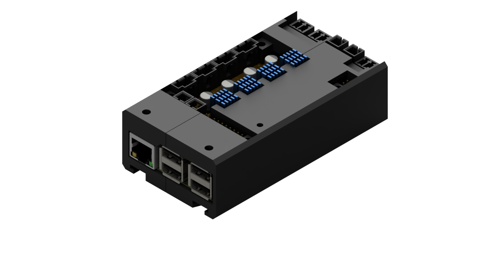
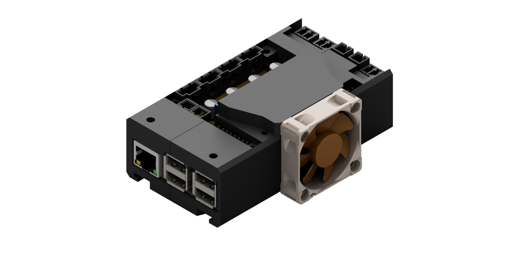

The printHAT enclosure is designed to accomodate the board and the Raspberry Pi. It is composed of two, easily 3D printable, halves and comes in two flavours, with and without cooling fan. 

| Simple  | Cooled | 
|:-------------------------:|:-------:|
| |  |

The forced cooling version is particularly indicated for all those applications where maximum performance of the drivers is needed, either because of high printing speed or because of big motors with high motor current. 
We recommend the use of one of the following fans:
* [Noctua NF-A4x10 5V](https://noctua.at/en/products/fan/nf-a4x10-5v), 40x40x10 mm size, 5V power supply
* [Noctua NF-A4x20 5V](https://noctua.at/en/products/fan/nf-a4x20-5v), 40x40x20 mm size, 5V power supply, for even greater flow

Enclosure and fan are assembled using the following fasteners  

| Qty | Article | Note |
|:---:|:---:|:---:|
| 4 | DIN912 M3x30 screw | enclosure to board  |
| 4 | M3 nut  | enclosure to board  |
| 4 | DIN912 M3x10 screw  | optional, 10mm fan  |
| 4 | DIN912 M3x20 screw  | optional, 20mm fan  |
| 2 | M5x8 screw  | enclosure to frame |
| 2 | M5 T-nut | enclosure to frame |
